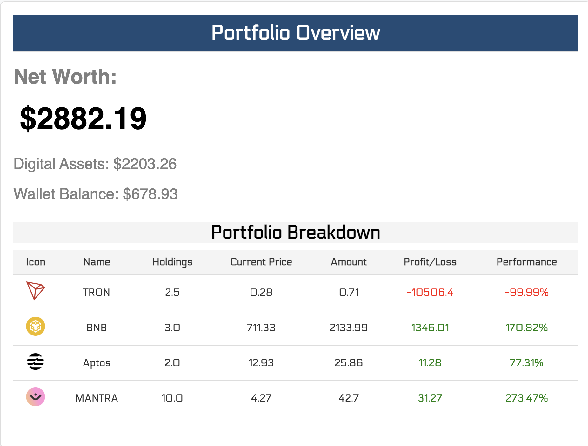
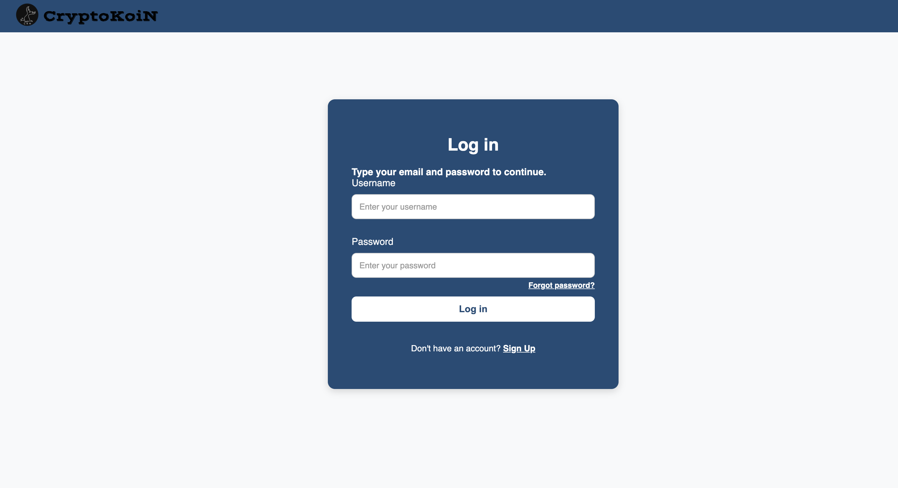
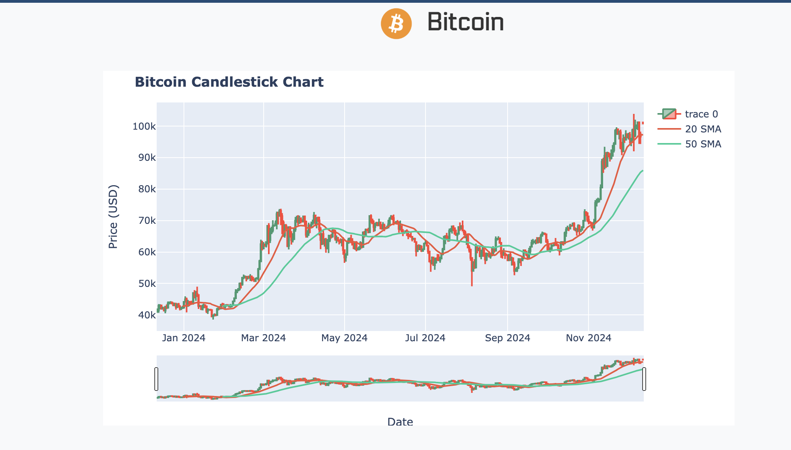

# CryptoKoiN
CryptoKoiN is a cryptocurrency web application that provides user-friendly features for managing cryptocurrency assets, tracking transactions, and visualizing market trends. The application supports both user and admin interfaces with secure functionality and robust data handling using SQL Server and Flask.

## Project Details

### Group Members:
- Gonuguntla Chandrakanth Naidu

### Narrative:
CryptoKoiN was developed to simplify cryptocurrency management for users while providing admins with tools to monitor and analyze transactions. The application integrates data from CoinGeckoAPI, ensuring real-time market updates and facilitating informed decision-making.

#### Primary Use Cases:
- Users can buy, sell, and track cryptocurrency.
- Admins can manage users and analyze transaction trends.

#### User Roles:
- **Customer**: Engage in cryptocurrency trading and monitor personal transactions.
- **Admin**: Oversee user activity, manage market data, and analyze revenue trends.

#### Main Purpose of Each User Role:
- **Customer**: Facilitate secure and efficient cryptocurrency management.
- **Admin**: Ensure system integrity and monitor overall application performance.

## *Relational Schema*

Below is the updated relational diagram illustrating the relationships between tables:


### *CryptoKoiN Database*


**Purpose:**

This database serves as the foundation for the CryptoCoin exchange platform, a comprehensive platform designed to facilitate the buying, selling, and trading of various cryptocurrencies. It houses essential data related to users, transactions, cryptocurrency information, and wallet activities.

**Database Structure**:\
The database comprises five tables, each with specific fields to store crucial information:

-   **Transaction_History:** Records of cryptocurrency buy, sell, and transfer transactions.
-   **User_Activity:** User login and logout activity.
-   **User_Data:** User information, including personal details and wallet balances.
-   **Crypto_Coins:** Information about various cryptocurrencies, such as prices, market cap, and historical data.
-   **Wallet_Transaction_History:** Records of deposits and withdrawals to user wallets.
---
## Features

- **Homepage**
- **User Main Menu**
- **Cryptocurrency Market**
- **Trading**
- **Currency Detailing**
- **Wallet Management**
- **Cryptocurrency Investments**
- **Transaction Management**
- **Profile Management**
- **Rewards Program**
  
- **Admin Dashboard**
- **User Management**
- **Market Management**
- **Transaction Analysis**


## Database Query Management 

In this architecture, three key Python files are responsible for managing database queries and external API interactions: `user.py`, `base.py`, and `cryptokoin_api.py`. These files streamline and centralize database operations and provide secure handling of queries while interacting with external services like CoinGecko for cryptocurrency data.

1.  **user.py**

    -   **Purpose**: Handles user-related operations like authentication, registration, and password validation.
    -   **Key Features**:
        -   `hashPassword`: Secures passwords using a hashing algorithm (MD5 with salt).
        -   `verify_new` & `verify_update`: Validates new and updated user data (e.g., username, email, password matching).
        -   `tryLogin`: Handles user login by validating credentials against the database.
          
2.  **baseObject.py**
    -   **Purpose**: Manages the basic database operations such as connecting to the database, executing CRUD operations, and handling database errors.
    -   **Key Features**:
        -   `setup`: Initializes the database connection and prepares the object for CRUD operations.
        -   `insert`, `update`, `deleteById`: Simplifies data insertion, updating, and deletion processes.
        -   `getAll`, `getById`, `getByField`: Fetches records from the database based on various conditions.
          
3.  **cryptokoin_apis.py**
    -   **Purpose**: Provides functions to interact with cryptocurrency APIs (like CoinGecko and Yahoo Finance) and manage cryptocurrency-related data.
    -   **Key Features**:
        -   `fetch_current_prices`: Retrieves real-time cryptocurrency prices from the CoinGecko API.
        -   `calculate_profit_loss`: Computes the profit or loss based on transaction history and current coin prices.
        -   `candle_stick_graph`: Generates a candlestick chart using historical data for a specific cryptocurrency.

This architecture ensures a modular, secure, and maintainable approach for handling user and database interactions, while also offering flexibility for integrating external APIs.


## Key Features and Functionalities
### User MainMenu Insights & Analytics


#### **Portfolio Overview**


- **Description**:\
  Displays a graphical representation of the user's cryptocurrency holdings and tracks the total portfolio value over time.

- **Purpose of the Graph**:  
  - Track cumulative cryptocurrency holdings day-by-day.  
  - Help users analyze their investment growth or decline.  
  - Enable users to make informed decisions on future trades.

- **SQL Query**:
  ```sql
  SELECT cc.image_url, cc.coin_id, cc.coin_symbol, cc.coin_name, th.transaction_type,th.quantity, th.total_amount, th.transaction_timestamp
  FROM `Transaction_History` th, Crypto_coins cc
  WHERE th.crypto_id = cc.cryptocoin_id AND th.user_id = %s```
- **Explanation**: 
  - Retrieves daily cryptocurrency holdings for the user.
  - Uses SUM(value) to calculate the cumulative portfolio value for each date.
  - Data is ordered by date to visualize portfolio trends effectively.
- **Insights Users Gain**:
  - Understand how their investments perform over time.
  - Identify profitable or unprofitable trends in specific periods.

### **Profitable Coins (24 Hours)**


- **Description**:  
  Highlights the cryptocurrencies with the highest profit percentages in the past 24 hours.
- **Purpose of the Graph**:  
  - Identify top-performing cryptocurrencies.
  - Assist users in making buy/sell decisions based on recent performance.

- **Backend Python Code**:
  ```python
    u = user()
    u.tn = 'Crypto_coins'
    u.getAll()
    sorted_data = sorted(u.data, key=lambda x: x['price_change_percentage_24h'], reverse=True)
  ```

- **Explanation**:
  - Fetches the top 5 cryptocurrencies by profit percentage in the last 24 hours.
  - Uses the formula ((current_price - opening_price) / opening_price) * 100 to calculate the profit percentage.
  - Orders the results by profit_percentage in descending order to show the highest gainers.
- **Insights Users Gain**:
  - Quickly identify profitable cryptocurrencies to take action.
  - Spot opportunities to buy/sell based on the latest market performance.

## Admin Dashboard  


- **Employ data analytics techniques to monitor user growth, cryptocurrency market trends, and daily revenue metrics.**
### **User Growth Trends**


- **Description**:  
  Displays a graph of user registrations, showing how the platform is growing over time.

- **Purpose of the Graph**:  
  - Analyze user growth trends over the last 12 months.
  - Understand the impact of campaigns and marketing strategies.

- **Python Code**:
  ```python
    u = user()
    u.getAll()
    data = u.data
    date_counts = Counter(us['created_at'].date() for us in data if us['role'] == 'user')
    
    # Get all dates between the earliest and latest user creation dates
    start_date = min(date_counts.keys())
    end_date = max(date_counts.keys())
    all_dates = [start_date + datetime.timedelta(days=i) for i in range((end_date - start_date).days + 1)]
    
    # Accumulate user count over time, filling missing dates with last known value
    cumsum_dict = {}
    last_count = 0
    for date in all_dates:
        if date in date_counts:
            last_count += date_counts[date]
        cumsum_dict[date.strftime("%Y-%m-%d")] = last_count
    
    t_users = last_count  
  ```
- **Explanation**:
  - Retrieves the number of new users registered each day for the past year.
  - Groups data by month to create a clear trend of user growth.

### **Total Users**


- **Description**:  
  Displays the total number of users registered on the platform.
  
- **SQL Query**:
  ```sql
       SELECT COUNT(*) AS total_users
       FROM user_table;
  ```
- **Explanation**:
  - Counts all users in the users table to provide the total user count.
  - Useful for monitoring the platform's user base.


### **Total Revenue from Transaction Fees**

- **Description**:  
  Highlights the total revenue generated from transaction fees.
  
- **Python Code**:
  ```python
       t_revenue = sum(float(tr['revenue']) for tr in transactions_list)
  ```
- **Explanation**:
  - Aggregates transaction fees for all transactions.
  - Provides insight into the platform's revenue performance.


### **Daily Revenue with Transaction Breakdown**


- **Description**:  
  Displays a breakdown of daily revenue trends based on transaction types (buy/sell).
  
- **SQL Query**:
  ```sql
    SELECT cc.image_url, ud.username, cc.coin_name, th.transaction_type, th.quantity, th.total_amount, th.tax,                   
    DATE(th.transaction_timestamp) AS transaction_date
    FROM `Transaction_History` th 
    JOIN Crypto_coins cc ON th.crypto_id = cc.cryptocoin_id 
    JOIN User_data ud ON th.user_id = ud.user_id 
    ORDER BY th.transaction_timestamp ASC; 
  ```
- **Explanation**:
  - Groups revenue data by transaction type and day.
  - Helps track which transaction types contribute the most to daily revenue.

### **Top Cryptocurrencies by Transaction Volume (Pie Chart)**


- **Description**:  
  A pie chart showing the most traded cryptocurrencies based on transaction volume.

- **Python Code**:
  ```python
  crypto_data = {}
    for d in data:
        if d['coin_name'] in crypto_data.keys():
            crypto_data[d['coin_name']] = crypto_data[d['coin_name']] + float(d['total_amount'])
        else:
            crypto_data[d['coin_name']] = float(d['total_amount'])

    # Process crypto data for pie chart
    def process_crypto_data(data):
        sorted_data = sorted(data.items(), key=lambda x: x[1], reverse=True)
        top5 = sorted_data[:5]
        others = sorted_data[5:]
        
        others_value = sum(value for _, value in others)
        
        final_data = top5 + [("Others", others_value)]
        total_value = sum(value for _, value in final_data)
        
        processed_data = [
            {"name": name, "value": value, "percentage": round((value / total_value) * 100, 2)}
            for name, value in final_data]
        
        return processed_data

    processed_crypto_data = process_crypto_data(crypto_data)
  ```
  
- **Explanation**:
  - data got from the Query used for `Daily Revenue with Transaction Breakdown` is used for this chart.
  - Fetches the top 10 cryptocurrencies by the number of transactions.
  - Groups by coin_id to count the transactions per cryptocurrency.


### **Top Users by Transaction Value**


- **Description**:  
  Lists the top users based on the total value of their transactions over the time.
  
- **Python Code**:
  ```python
    user_totals = defaultdict(float)
    for d in data:
        user_totals[d['username']] += float(d['total_amount'])
    
    top_users_list = [{"username": user, "transaction_amount": amount} for user, amount in user_totals.items()]
    top_users_list = sorted(top_users_list, key=lambda x: x["transaction_amount"], reverse=True)
  ```
- **Explanation**:
  - Aggregates transaction values for each user to identify the highest contributors.
  - Orders by total_transaction_value in descending order to highlight top users.

## Detail Feature Explanation
### **Homepage**


- **Description**:  
  The homepage acts as the starting point for the CryptoKoin platform, offering navigation to key functionalities like login, sign-up, and password reset.

- **Purpose**:
  - Provide clear navigation options for new and returning users.
  - Serve as the entry point for account authentication and recovery.

- **Backend Flow**:
  - No direct SQL interaction here, as this page only provides navigation links.
    
- **Next Actions**:
  - Users select **Log In**, **Sign Up**, or **Reset Password** to proceed to specific functionalities.

### **Login**


- **Description**:  
  This page allows users to authenticate themselves by entering a username and password.
- **Purpose**:
  - Validate user credentials against stored data.
  - Redirect valid users to their respective dashboard (user or admin).
  - Start user session tracking for activity monitoring.
- **Explanation**:
  - The `username` and `password` fields submitted by the user are captured via `request.form`.
  - The SQL query checks if a matching username-password pair exists in the users table.
  - If a match is found:
    - User session starts.
    - User activity timer begins (30-minute inactivity logout threshold).
    - Redirect:
        - If user_role == 'admin', the user is redirected to the Admin Dashboard.
        - Otherwise, the user is redirected to the User Dashboard.
  - If no match is found, an error message is returned.

- **Insights Users Gain**:
  - Seamless access to their accounts upon valid login.
  - Role-based redirection ensures proper navigation.

### **Create Account**


- **Description**:  
  This page enables new users to sign up by entering required details like username, email, and password.
- **Purpose**:
  - Add a new user to the platform's database.
  - Ensure input validation and prevent duplicate accounts.
- **Explanation**:
  - User input (username, email, password, and optional referral_code) is captured via request.form.
  - A check is performed to ensure the username or email doesn't already exist.
  - If validation passes, the user is added to the users table.
  - On successful creation, the user is redirected to the **Login Page**.

- **Insights Users Gain**:
  - Confidence in a secure and validated sign-up process.

### **Reset Password**


- **Description**:  
  Allows users to reset their password by verifying their username and email.

- **Purpose**:
  - Update a user’s password securely.
  - Redirect the user to the login page after successful reset.
- **Explanation**:
  - User input (username, email, and new_password) is captured via request.form.
  - The SQL query verifies the existence of the username-email combination before updating the password.
  - On successful reset, the user is redirected to the **Login Page**.
- **Insights Users Gain**:
  - Assurance of a secure password recovery process.

### **User Investment**


- **Description**:  
  The investment page displays the user's current cryptocurrency portfolio, showing an overview of the coins they hold, quantities, and their total portfolio value.

- **Purpose of the Template**:
  To deliver a seamless and intuitive interface for users to manage their cryptocurrency investments.

- **SQL Query**:
  ```sql
  SELECT cc.image_url, cc.coin_id, cc.coin_symbol, cc.coin_name, th.transaction_type,th.quantity, th.total_amount, th.transaction_timestamp
  FROM `Transaction_History` th, Crypto_coins cc
  WHERE th.crypto_id = cc.cryptocoin_id
  AND th.user_id = %s
  ```
- **Explanation**:
  - **Portfolio Value**: Highlights the total value of the user's portfolio, dynamically calculated using the current balance of all investments.
  - **Investment Table**:
    - **Icon**: Displays the coin's logo.
    - **Coin Name**: The name of the cryptocurrency.
    - **Quantity**: The number of coins held.
    - **Current Price**: Shows the live price of the cryptocurrency.
    - **Current Value**: The total value of holdings for that coin, calculated as Quantity x Current Price.

- **Insights Users Gain**:
  - Real-time updates on their portfolio’s worth.
  - Clear breakdown of their holdings by coin, aiding in strategic decision-making.

- **Notes**:
  - Option to link to a "Details" or "Market" page for deeper insights into each coin.
  - A "Trade" button can be added for quick actions like buying or selling coins.

### **Market Overview**

- **Description**:
  The market page lists cryptocurrencies with key data such as price, 24-hour changes, and a link to detailed views.

- **Purpose of the Template**:
  To provide users with a marketplace to explore various cryptocurrencies and their performance metrics.

- **Python Code**:
  ```python
    u = user()
    u.tn = 'Crypto_coins'
    u.getAll() 
    return render_template('market.html', coins= u.data,navigation_items=True)
  ```
- **Explanation**:
    - **Crypto Table**:
    - **Logo**: Displays the coin’s logo.
    - **Symbol and Name**: Shows the ticker and name of the coin.
    - **Price**: Real-time price of the cryptocurrency in USD.
    - **24h Change (% and $)**: Indicates percentage and absolute change in value over 24 hours.
    - **Details**: Links to the details page for in-depth analysis.

- **Insights Users Gain**:
  - Real-time performance metrics of cryptocurrencies.
  - Links to detailed data for better-informed trading decisions.
  - Enables real-time tracking of cryptocurrency trends to make informed trading decisions.
- **Notes**:
  - Provide filters for sorting (e.g., by price or market cap).
  - Option for a "Trade" button to directly transition to trading from this page.

### **Coin Insights**

- **Description**:
  The details page gives a comprehensive view of a specific cryptocurrency,       including its price trends and market statistics.

- **Purpose of the Template**:
  To assist users in analyzing a particular cryptocurrency deeply before making trading decisions.
  
- **Python Code**:
  ```python
    u = user()
    u.tn = 'Crypto_coins'
    u.getByField('coin_symbol',coin_id)
    coin = None
    if len(u.data)>0:   
        coin = u.data[0]
    if not coin:
        return render_template('details.html', message="Coin not found"), 404
    graph_html = cryptokoin_api.candle_stick_graph(coin)
    return render_template('details.html', graph_html=graph_html, coin=coin, navigation_items=True)
  ```
- **Explanation**:
  - **Graph Container**: Displays a candlestick chart for price movements.
  - **Coin Details**:
    - Includes data like symbol, current price, market cap, 24-hour high/low, and all-time highs.
    - Highlights percentage changes in different time frames.
  - **Trade Button**: Redirects users to the trade page for buying or selling the cryptocurrency.

- **Insights Users Gain**:
  - Price trends for the coin to make informed buy/sell decisions.
  - Market statistics like rank and cap to gauge the coin's popularity and stability.

- **Notes**:
  - Ensure seamless navigation between this and the trade page for user convenience.
  - Add historical data for advanced analysis.


### **Cryptocurrency Trading **

- **Description**:
The trade page allows users to buy and sell cryptocurrencies within the cryptoKoin platform. It provides a user-friendly interface for selecting cryptocurrencies, entering trade details, and viewing real-time calculations.

- **Purpose of the Template**:
  - Trade Mode Selection: Users can choose between "Buy" and "Sell" mode using radio buttons. This selection dynamically affects the form behavior and displayed information.
 
- **SQL Query**:
  ```sql
  SELECT c.cryptocoin_id, c.coin_symbol, c.coin_name, c.current_price, c.image_url,
  IFNULL(SUM(CASE WHEN t.transaction_type = 'BUY' THEN t.quantity 
  WHEN t.transaction_type = 'SELL' THEN -t.quantity ELSE 0 END), 0) AS shares_owned
  FROM Crypto_coins c LEFT JOIN Transaction_History t ON c.cryptocoin_id = t.crypto_id AND t.user_id = %s
  GROUP BY c.cryptocoin_id, c.coin_symbol, c.coin_name, c.current_price, c.image_url;
  ```
- **Explanation**:
  - Cryptocurrency Selection: A dropdown menu populated with available cryptocurrencies allows users to choose the coin they want to trade. The dropdown displays relevant data like coin symbol, name, and (for "Sell" mode) the user's current holdings of that coin.
  - Trade Input: Users enter the number of shares they want to buy or sell in a dedicated input field.
  - Real-time Calculations: Based on the selected cryptocurrency and entered quantity, the page dynamically calculates and displays the following:
    -   Total Price: The total cost of the trade (coin price multiplied by quantity).
    -   CKN Fee (3%): The transaction fee applied by cryptoKoin (3% of the total price).
    -   Total Amount: The final amount payable (total price plus fee for buying, or total price minus fee for selling).
  -   Form Submission: Clicking the "Submit" button triggers form validation and sends the trade request to the server for processing.
  
- **Insights Users Gain**:
  -   Easy-to-use interface for buying and selling cryptocurrencies.
  -   Real-time price and transaction fee calculations for informed decisions.
  -   Clear distinction between "Buy" and "Sell" modes for clarity.


### **User Transactions **:

- **Description**: 
  The transactions page lists all trades performed by the user, including buys and sells.
- **Purpose of the Template**:
  To provide users with a history of their transactions, helping them track their activity and analyze past trades.

- **SQL Query**:
  ```sql
  SELECT cc.image_url,cc.coin_name,th.transaction_type,th.quantity,th.total_amount,th.transaction_timestamp
  FROM `Transaction_History` th, Crypto_coins cc
  WHERE th.crypto_id = cc.cryptocoin_id
  AND th.user_id =%s
  ORDER BY `th`.`transaction_timestamp` DESC
  ```
- **Explanation**:
  - **Transaction Table**:
    - **Icon and Coin Name**: Indicates the traded cryptocurrency.
    - **Order Type**: Specifies whether it was a buy or sell order.
    - **Quantity and Value**: Shows the number of coins traded and the transaction value.
    - **Date**: Timestamp of the transaction.

- **Insights Users Gain**:
  - Detailed overview of their trade history.
  - Ability to analyze trading patterns and performance.

- **Notes**:
  - Include a note: "Similar to Transactions, there’s also a page for Wallet Transactions to view previous deposit/withdrawal history."
  - Add filters for sorting by date or transaction type.

 ### **Wallet Deposit Page**:

- **Description**:
  This page allows users to deposit funds into their wallet using credit card details.

- **Purpose of the Template**:
  To enable users to seamlessly add funds to their wallets for trading or investment purposes.
  
- **SQL Query**:
  ```python
  u = user()
  u.tn = 'Wallet_Transaction_History'
  u.fields = []
  u.getFields()
  u.createBlank()
  u.data[0] = dict(zip(u.fields,['Deposit', amount, datetime.datetime.now().strftime("%Y-%m-%d %H:%M:%S"), user_id]))
  u.insert()
  ```
- **Explanation**:
  - **Deposit Form**:
    - Collects information like deposit amount, cardholder name, card number, expiry date, and CVV.
    - Ensures secure submission of financial data.
      
- **Insights Users Gain**:
  - A transparent and secure way to recharge their wallets.
  - Real-time updates on wallet balance post-deposit.
- **Notes**:
  -  "Just like Wallet Deposit, there’s also a page for Wallet Withdrawal to transfer funds back to the user’s bank account."

### **Account Overview**

- **Description**:
  The user profile page displays user-specific information, including account details and wallet balance.

- **Purpose of the Template**:
  To provide users with a centralized view of their account information.

- **Python Code**:
  ```python
    user_id = session['user']['user_id']
    u= user()
    u.getById(user_id)
    u_details = u.data[0]
    u_details['username'] = u_details['username'].upper()
    u_details['created_at'] = u_details['created_at'].strftime("%B %d, %Y") 
    return render_template('user_profile.html',user = u_details, navigation_items=True)
  ```
- **Explanation**:

  - **Profile Data**:
    - Displays username, email, role, membership duration, and wallet balance.
    - Includes action links for password reset and wallet recharge.
- **Insights Users Gain**:
  - A snapshot of their account and financial standing.
  - Easy access to essential account actions.
- **Notes** 
  - Include links for resetting passwords and recharging wallets.
  - Provide an option for updating profile information or security settings.

### **Rewards and Referral Program**

-   **Referral Program**:\
    The referral program incentivizes users to invite new members to the platform. Each user's **username** serves as their unique referral code. When a new user signs up using the referral code, the following actions occur:

    1.  The existing user who referred them gets **credited with 1 referral** in their account.
    2.  Referral counts are dynamically updated for the referrer, enabling users to track their referral progress in real time.
    3.  Additional rewards or bonuses may be linked to milestones in the referral count, encouraging active participation.
-   **New Cryptocurrency Launch**:\
    The platform supports the launch of new cryptocurrencies. This feature allows the platform to:

    1.  Introduce new coins into the market with detailed pages for each coin, including their performance metrics and price trends.
    2.  Offer users an opportunity to explore and invest in early-stage cryptocurrencies.
    3.  Ensure that newly launched coins are prominently displayed, creating visibility and driving initial traction.

**Notes**:

-   The referral system ensures transparency and fairness by tying rewards directly to user activity.
-   The new cryptocurrency launch feature adds diversity to the market offerings, encouraging users to stay engaged.

### Logo Functionality

  -   **Prominent Placement:** The CryptoKoiN logo is strategically positioned in the top right corner of the taskbar, ensuring its visibility across all pages.
  -   **Interactive Design:** The logo is designed to be clickable. When a user hovers over it, the color changes from #1f4c76 to yellow, indicating its interactive nature.
  -   **User-Centric Redirection:** Upon clicking the logo, users are redirected to appropriate starting points:
    -   **Logged-in Users:** User dashboard or admin dashboard.
    -   **Unauthenticated Users:** Homepage for login or registration.
  - **Seamless User Experience:** The logo provides a consistent way for users to navigate back to the main sections of the website, enhancing usability.

### **User Session and Security Management**

1.  **Tracking User Login and Session Duration**: Captures login time, session start, and session duration in the database for security and activity tracking.
2.  **Session Timeout Management**: Ensures user sessions automatically expire after 30 minutes of inactivity, preventing unauthorized access.
3.  **Login Error Handling**: Logs failed login attempts and provides clear feedback to users in case of incorrect credentials or session timeouts.
4.  **Database Structure for User Activity**: Utilizes the `user_activity` table to store detailed user login/logout information and track session lengths.


### Error Management and User Guidance

1.  **Centralized Error Handling Across the Application**

    -   Errors are detected at every stage of user interaction, from login to transactions. The system checks for invalid input formats, insufficient funds, or unauthorized access at each point, ensuring that issues are caught early.
2.  **Actionable Feedback for Users**

    -   When an error occurs, the system provides clear, user-friendly messages guiding users on how to resolve the issue. For instance, if the user enters an incorrect email format, the system will show "Please enter a valid email address," helping users correct their mistakes.
3.  **Error Logging and Prevention Measures**

    -   All error occurrences are logged for monitoring and future improvements. In case of failed transactions or invalid actions (like attempting to sell more than holdings), the system ensures no data corruption or inconsistency occurs, and errors are logged for review and resolution.
4.  **Potential Errors and Examples**

    -   Errors may include login failures due to incorrect credentials, insufficient balance during transactions, unauthorized access to restricted pages, or session timeouts. These errors prevent users from performing unauthorized actions or losing data integrity. Examples: Invalid email format, selling more than holdings, session timeout.


## Credentials per User Role

| Role       | Username     | Password   |
|------------|--------------|------------|
| Customer   | srikanth        | 123456    |
| Admin      | chandu       | 123456   |


### Core Functionality:
- **Data Handling**:
  - Secure storage of user and transaction data using SQL Server.
  - Data updates from CoinGeckoAPI.
- **Visualizations**:
  - Graphical representations of market trends using candlestick charts.


## Application Setup Guide

### Prerequisites:
- Python (3.8 or higher)
- Flask
- SQL Server
- CoinAPI key

### Installation:
1. Clone this repository:
   ```bash
   git clone <repository_url>
   cd CryptoKoiN
   ```
2. Install dependencies:
   ```bash
   pip install -r requirements.txt
   ```
3. Configure the database:
   - Set up a SQL Server database.
   - Update database connection details in the `config.py` file.
4. Configure CoinAPI:
   - Obtain an API key from [CoinAPI](https://www.coingeckoapi.io/).
   - Update the API key in the `cryptokoin_api.py` file.

### Running the Application:
1. Start the Flask development server:
   ```bash
   python app.py
   ```
2. Access the application in your browser at `http://127.0.0.1:5000`.

## Folder Structure
- `templates/`: HTML templates for the application.
- `static/`: CSS, JavaScript, and image files.
- `app.py`: Main Flask application file.
- `config.yml`: Configuration file for database and API keys.
- `test.ipynb`: Query testing file
- `user_ckn.py`: Data handling.
- `baseObject.py`: Data handling.
- `cryptokoin_api.py`: API integration and data handling.

## APIs and Endpoints

### User Endpoints:

- `/mainmenu` - User main menu.
- `/mainmenu/wallet/withdraw` - Wallet withdrawal functionality.
- `/mainmenu/wallet/transactions` - View wallet transaction history.
- `/mainmenu/investments` - View investments and profit/loss analysis.
- `/mainmenu/transactions` - View transaction history.
- `/mainmenu/account/profile` - View user profile.
- `/mainmenu/market` - Manage market data.
- `/details/<coin_id>` - View coin details with candlestick graph.
- `/mainmenu/rewards` - Referral Program and Launching a new cryptocurrency

### Admin Endpoints:
- `/admin_mainmenu` - Admin dashboard.
- `/admin_mainmenu/user_management` - Manage users.
- `/admin_mainmenu/transactions` - View transactions.
- `/admin_mainmenu/wallet_transactions` - View wallet transactions.
- `/admin_mainmenu/market` - Manage market data.
- `/admin_coin_details/<coin_id>` - View coin details with candlestick graph.


